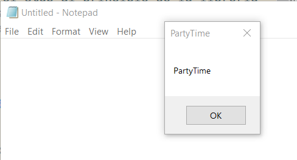

# MyReflectDll

En la reflectiva DLL de [Stephen Fewers](https://github.com/stephenfewer/ReflectiveDLLInjection) trato de añadir un bootstrap al principio de la cabecera DOS para luego ser llamado por un inyector (MyInject) que pasa la dll reflectiva a shellcode y la inyecta con CreateRemoteThread. 

He usado como base el [reflectpatcher.py](https://github.com/BorjaMerino/reflectPatcher/tree/master) de [@BorjaMerino](https://github.com/BorjaMerino) para "patchear" el stub al principio de la librería original. Los scripts de python2 y los "releases" se encuentran centralizados en el directorio [bin](./bin).


## Compilación y uso

Compilado en Visual Studio 2022, crea los binarios en la carpeta [bin](./bin).

Una vez generados las dlls y los binarios en la arquitectura correspondiente, hay que ejecutar el script de python2 correspondiente para añadir el stub. Yo uso [VIRTUALENV](https://www.kali.org/docs/general-use/using-eol-python-versions/) para instalarme una versión de python obsoleta. Quien quiera pasarlos a python3 es bienvenido. 

```
└─$ python reflectPatcher[64].py MyReflectiveDLL[64].dll
[*] MyReflectiveDLL[64].dll loaded
[*] ReflectiveLoader export Found! Ord:1 EntryPoint offset: 1120h
[+] Patched! payload_mod[64].dll (12288 bytes).
```

Una vez que tenemos la libreria parcheada solo hay que probar a inyectarla:

```
.\MyInject[64].exe 21948 .\payload_mod[64].dll
Dll Size: 12288         PID: 21948      [*]Remote Address: 00000217C0760000

Injection successfull
Running Shellcode......
```
Resultado de la inyección:


